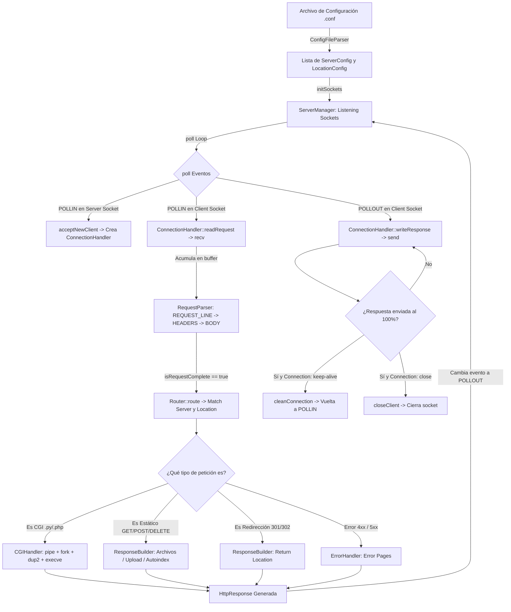

# 📖 Guía de Arquitectura y Funcionamiento — Webserv (42)

Esta guía está diseñada para que cualquier desarrollador entienda **cómo funciona el proyecto de inicio a fin**, qué hace cada clase y cómo fluyen los datos antes de empezar a corregir errores y refactorizar.

---

## 🏛️ 1. Filosofía y Modelo de Concurrencia

Webserv sigue el patrón de diseño **Reactor (Event-Driven / I/O Multiplexing)** en un único hilo de ejecución, de manera análoga a **NGINX** o **Node.js**:

* **Un solo hilo:** No se crean hilos (`pthread`) ni procesos `fork()` para atender a los clientes (el único `fork()` permitido por el subject es para scripts CGI).
* **Sockets no bloqueantes (`O_NONBLOCK`):** Ninguna operación de socket (`accept`, `recv`, `send`) bloquea el hilo principal.
* **Multiplexor central (`poll()`):** El kernel nos avisa cuándo un socket tiene datos listos para leer (`POLLIN`) o espacio en buffer para escribir (`POLLOUT`).

---

## 🗺️ 2. Mapa Arquitectónico Global



---

## 🔍 3. Ciclo de Vida de una Petición (Paso a Paso)

### Paso 1: Arranque y Configuración ([`ConfigFileParser`](file:///wsl.localhost/Ubuntu-24.04/home/maximo/Development/42/webserv/sources/ConfigFileParser.cpp))
1. `main()` en [`webserv.cpp`](file:///wsl.localhost/Ubuntu-24.04/home/maximo/Development/42/webserv/sources/webserv.cpp) recibe la ruta del archivo de configuración.
2. `ConfigFileParser::parse()` lee el archivo, elimina comentarios `#`, lo divide en tokens (`{`, `}`, `;`, directivas) y crea un `std::vector<ServerConfig>`.
3. Para cada servidor, rellena valores por defecto y aplica la **herencia de directivas** (las `location` heredan `root`, `index`, `autoindex` de su `server` padre si no los especifican).

### Paso 2: Apertura de Sockets de Escucha ([`ServerManager::initSockets`](file:///wsl.localhost/Ubuntu-24.04/home/maximo/Development/42/webserv/sources/ServerManager.cpp#L71))
1. Agrupa todos los servidores por combinación única `(IP, Puerto)` para no intentar hacer `bind()` dos veces al mismo puerto.
2. Crea el socket con `socket(AF_INET, SOCK_STREAM, 0)`.
3. Activa `SO_REUSEADDR` con `setsockopt()` para reutilizar el puerto inmediatamente si reinicias el servidor.
4. Establece el socket como no bloqueante con `fcntl(sockfd, F_SETFL, O_NONBLOCK)`.
5. Ejecuta `bind()` y `listen()`, y añade el descriptor al vector `pollfds` con el flag `POLLIN`.

### Paso 3: El Bucle Central de Eventos ([`ServerManager::run`](file:///wsl.localhost/Ubuntu-24.04/home/maximo/Development/42/webserv/sources/ServerManager.cpp#L148))
El servidor entra en un `while (true)` infinito gobernado por:
```cpp
int ready = poll(this->pollfds.data(), this->pollfds.size(), timeout);
```
- Si `ready == 0`: Comprueba si alguna conexión de cliente superó el tiempo de inactividad (`TIMEOUT = 5 min`) y la cierra.
- Si `ready > 0`: Itera sobre `pollfds` y procesa los descriptores con eventos:
  - **Descriptor de Servidor + `POLLIN`:** Hay un nuevo cliente esperando. Llama a `acceptNewClient()`.
  - **Descriptor de Cliente + `POLLIN`:** El cliente envió datos. Llama a `handleClientRequest()`.
  - **Descriptor de Cliente + `POLLOUT`:** El socket está listo para enviar la respuesta. Llama a `handleClientRequest()`.

### Paso 4: Aceptación de Clientes ([`ServerManager::acceptNewClient`](file:///wsl.localhost/Ubuntu-24.04/home/maximo/Development/42/webserv/sources/ServerManager.cpp#L245))
1. Llama a `accept(server_fd, NULL, NULL)` para obtener `client_fd`.
2. Establece `client_fd` en modo no bloqueante (`O_NONBLOCK`).
3. Crea un objeto `ConnectionHandler(client_fd)` y lo asocia en el mapa `clientConnections[client_fd]`.
4. Añade `client_fd` al vector `pollfds` escuchando `POLLIN`.

### Paso 5: Lectura y Parsing HTTP ([`ConnectionHandler`](file:///wsl.localhost/Ubuntu-24.04/home/maximo/Development/42/webserv/sources/ConnectionHandler.cpp) & [`RequestParser`](file:///wsl.localhost/Ubuntu-24.04/home/maximo/Development/42/webserv/sources/RequestParser.cpp))
1. [`readRequest()`](file:///wsl.localhost/Ubuntu-24.04/home/maximo/Development/42/webserv/sources/ConnectionHandler.cpp#L210) ejecuta `recv(fd, tmpBuffer, BUFFER_SIZE, 0)` y añade los bytes leídos a `buffer`.
2. Busca `\r\n\r\n` (final de cabeceras).
3. Pasa línea por línea a [`RequestParser::parseLine()`](file:///wsl.localhost/Ubuntu-24.04/home/maximo/Development/42/webserv/sources/RequestParser.cpp#L50), que avanza por 4 fases:
   - `REQUEST_LINE`: Extrae Método (`GET`/`POST`/`DELETE`), URI y Protocolo (`HTTP/1.1`).
   - `HEADERS`: Extrae pares `Clave: Valor` (`Host`, `Content-Length`, `Connection`, etc.).
   - `BODY`: Si hay `Content-Length`, acumula bytes del cuerpo hasta completarlo.
   - `COMPLETE`: Marca la petición como finalizada y almacena el objeto [`HttpRequest`](file:///wsl.localhost/Ubuntu-24.04/home/maximo/Development/42/webserv/sources/HttpRequest.cpp).

### Paso 6: Enrutamiento ([`Router::route`](file:///wsl.localhost/Ubuntu-24.04/home/maximo/Development/42/webserv/sources/Router.cpp#L27))
Determina la configuración exacta para responder:
1. **Servidor Virtual:** Compara la cabecera `Host` con los `server_name` de los bloques `server` del mismo puerto.
2. **Location Match:**
   - Busca primero coincidencia exacta (`location = /ruta`).
   - Si no, busca la coincidencia de prefijo más larga (*Longest Prefix Match*).
   - Si ninguna coincide, aplica `location /`.
3. Devuelve `std::pair<ServerConfig, LocationConfig>`.

### Paso 7: Generación de Respuesta ([`ResponseBuilder`](file:///wsl.localhost/Ubuntu-24.04/home/maximo/Development/42/webserv/sources/ResponseBuilder.cpp))
1. **Valida Métodos Permitidos:** Si el método no está en `location.allowed_methods`, devuelve `405 Method Not Allowed`.
2. **Redirecciones:** Si hay directiva `return` (301, 302, etc.), construye la respuesta con cabecera `Location`.
3. **CGI:** Si la URI termina en `cgi_extension` (ej: `.py`), delega en [`CGIHandler`](file:///wsl.localhost/Ubuntu-24.04/home/maximo/Development/42/webserv/sources/CGIHandler.cpp).
4. **GET Estático:**
   - Resuelve la ruta física del archivo.
   - Si es directorio: busca archivos `index` (`index.html`). Si no hay y `autoindex on`, genera el listado HTML. Si no, `403 Forbidden`.
   - Si es archivo: comprueba permisos de lectura `access(path, R_OK)`, detecta el tipo MIME (`text/html`, `image/png`, etc.) y devuelve `200 OK` con el contenido.
5. **POST (Upload):**
   - Comprueba `upload_enable on`.
   - Si supera `client_max_body_size`, responde `413 Payload Too Large`.
   - Guarda el body en disco y responde `201 Created`.
6. **DELETE:**
   - Comprueba permisos de escritura y borra el archivo con `std::remove(path.c_str())`. Devuelve `204 No Content`.

### Paso 8: Envío No Bloqueante ([`ConnectionHandler::writeResponse`](file:///wsl.localhost/Ubuntu-24.04/home/maximo/Development/42/webserv/sources/ConnectionHandler.cpp#L63))
1. Convierte el objeto `HttpResponse` a string con `response.build()`.
2. Llama a `send(fd, sendBuffer.c_str() + sendOffset, bytes_restantes, 0)`.
3. Incrementa `sendOffset` con los bytes realmente enviados.
4. Si `sendOffset == sendBuffer.size()`, la respuesta está completa:
   - Si `Connection: close` o error: Cierra el socket con `closeClient()`.
   - Si `Connection: keep-alive`: Llama a `cleanConnection()` para limpiar buffers y vuelve a poner el socket en `POLLIN`.

---

## 📂 4. Guía de Archivos y Responsabilidades

| Clase / Archivo | Responsabilidad Principal | Métodos Clave |
| :--- | :--- | :--- |
| **`ServerManager`** | Orquestador principal de red y bucle `poll()`. | `initSockets()`, `run()`, `acceptNewClient()`, `closeClient()` |
| **`ConnectionHandler`** | Estado y buffers de un cliente conectado (`READING`, `WRITING`, `READY`). | `readRequest()`, `parseRequest()`, `writeResponse()`, `cleanConnection()` |
| **`RequestParser`** | Máquina de estados para parsear texto HTTP crudo a `HttpRequest`. | `parseLine()`, `isRequestComplete()`, `getHttpRequest()` |
| **`Router`** | Selecciona el `ServerConfig` (por Host) y `LocationConfig` (por URI). | `route()` |
| **`ResponseBuilder`** | Lógica de negocio HTTP: GET, POST (upload), DELETE, Autoindex, MIME types. | `generateHttpResponse()`, `getPath()`, `generateAutoIndexHtml()` |
| **`CGIHandler`** | Ejecuta scripts CGI mediante `pipe()`, `fork()`, `dup2()`, `execve()`. | `setupEnv()`, `forkExecute()`, `executeScript()` |
| **`ErrorHandler`** | Construye respuestas de error con páginas por defecto o personalizadas. | `generateHttpResponse(status_code, config)` |
| **`ConfigFileParser`** | Parsea archivos `.config` estilo NGINX y valida directivas. | `parse()`, `tokenizer()`, `parseServerBlock()`, `parseLocationBlock()` |
| **`Utils`** | Funciones auxiliares de strings, paths, decodificación URL y stat. | `splitBySpaces()`, `isDirectory()`, `fileExists()`, `getNextLine()` |

---

## 🛠️ 5. Guía Práctica para Depurar y Corregir Errores

### ¿Dónde tocar según el tipo de bug?

1. **Si falla una subida (POST) o borrado (DELETE):**
   - Revisa [`sources/ResponseBuilder.cpp`](file:///wsl.localhost/Ubuntu-24.04/home/maximo/Development/42/webserv/sources/ResponseBuilder.cpp#L456) (método POST y DELETE) y elimina cualquier ruta fija `/home/jrey-roj/...`.

2. **Si el servidor se congela al ejecutar un CGI:**
   - Revisa [`sources/CGIHandler.cpp`](file:///wsl.localhost/Ubuntu-24.04/home/maximo/Development/42/webserv/sources/CGIHandler.cpp#L112). Las tuberías no deben bloquear el proceso padre. Añade `chdir()` antes de `execve()` y gestiona la salida del hijo con timeouts y `WNOHANG`.

3. **Si el servidor pierde clientes o crashea en peticiones masivas:**
   - Revisa [`sources/ServerManager.cpp`](file:///wsl.localhost/Ubuntu-24.04/home/maximo/Development/42/webserv/sources/ServerManager.cpp#L182). Asegúrate de no hacer `pollfds.push_back()` o `pollfds.erase()` alterando los índices del bucle `for` activo.

4. **Si el navegador recibe cabeceras corruptas o incompletas:**
   - Revisa [`sources/RequestParser.cpp`](file:///wsl.localhost/Ubuntu-24.04/home/maximo/Development/42/webserv/sources/RequestParser.cpp#L178). Reemplaza `splitBySpaces()` por búsqueda de `:` para no partir cabeceras como `User-Agent` que contienen espacios legítimos.

5. **Si el tester de 42 falla en peticiones `chunked`:**
   - Revisa [`sources/RequestParser.cpp`](file:///wsl.localhost/Ubuntu-24.04/home/maximo/Development/42/webserv/sources/RequestParser.cpp#L122). Implementa el desfragmentado de bloques `Transfer-Encoding: chunked`.

---

## 🧪 6. Comandos Útiles para Pruebas y Depuración

### 1. Compilación limpia con sanitizers
```bash
make re
```

### 2. Probar peticiones HTTP crudas con `curl -v`
```bash
# Ver cabeceras completas de petición y respuesta
curl -v http://localhost:8080/

# Probar subida de archivo
curl -v -X POST --data "Hola Mundo" http://localhost:8080/upload/

# Probar borrado de archivo
curl -v -X DELETE http://localhost:8080/upload/test.txt

# Probar ejecución de CGI
curl -v http://localhost:8080/cgi-bin/getrequest.py?name=42Madrid
```

### 3. Probar Keep-Alive manual con `nc` (Netcat)
```bash
printf "GET / HTTP/1.1\r\nHost: localhost\r\nConnection: keep-alive\r\n\r\nGET / HTTP/1.1\r\nHost: localhost\r\nConnection: close\r\n\r\n" | nc localhost 8080
```

### 4. Prueba de estrés de concurrencia con `siege`
```bash
siege -b -c 50 -t 10S http://localhost:8080/
```
*(El servidor debe mantener una disponibilidad del 99.5% o superior sin congelarse ni caerse).*
